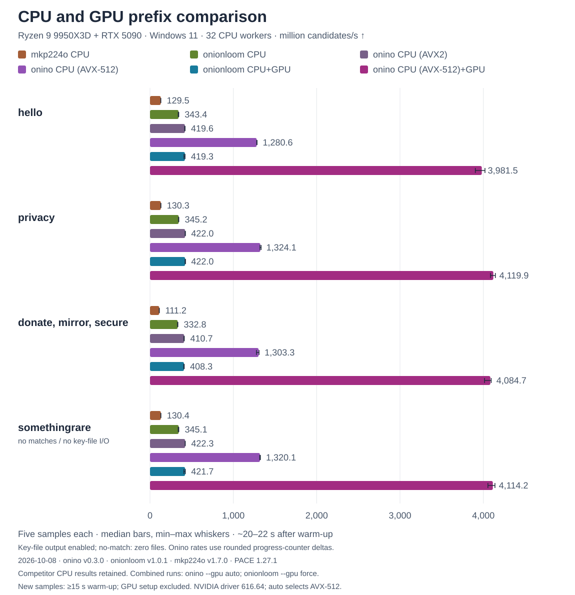
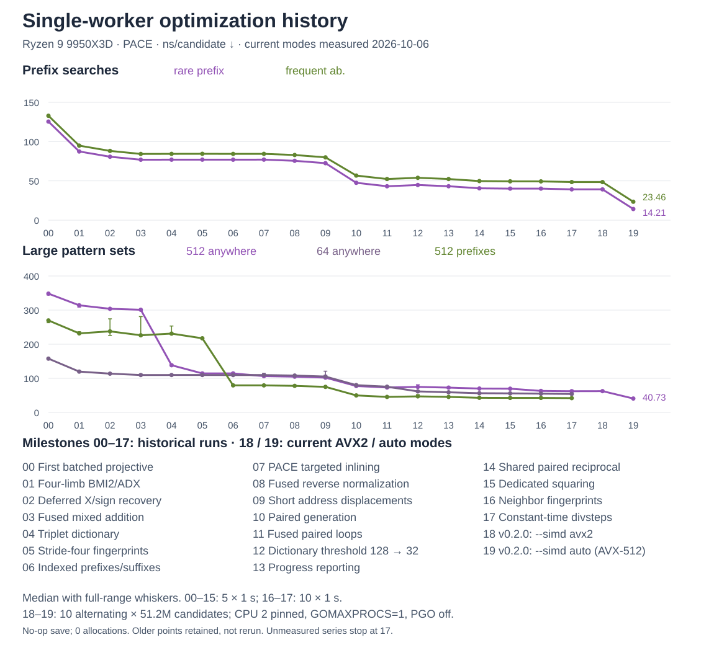

# onino

CPU-only vanity v3 `.onion` address search across the first **52 visible hostname characters**. onino matches public keys against compiled patterns and keeps searching after saving matches. It defaults to one worker; use `--cpu` for multicore search.

## Build and use

PACE is the primary build and release target. It enables register-ABI assembly calls and explicit inlining in the matcher and search engine. Use a toolchain compatible with the Go 1.27.1 version declared in `go.mod`:

```sh
pace build -o onino .
./onino --output matches 'hello.' 'onino.'
./onino --cpu all 'hello.'
```

On Windows, build with `pace build -o onino.exe .` and invoke `./onino.exe`. Stock `go build` is supported as an alternative when PACE is unavailable.

Use `--help` for usage and `--output` / `-o` to select the destination directory; it defaults to `matches`.

`--cpu` accepts a positive integer or `all`, bounded by the logical CPUs available to the process. Windows/Linux affinity restrictions are respected. Multiple workers use discovered physical cores before SMT siblings and spread across last-level caches; unsupported topology uses OS placement and says so at startup. The flag selects search workers, not total runtime threads.

Patterns are ORed together. Supported forms are `prefix.`, `.suffix`, `prefix.suffix`, `.interior.` and `anywhere`; see [the matcher documentation](internal/pattern/README.md) for precise rules and validation.

All patterns match the **first 52 characters actually printed in the hostname**. A suffix ends at character 52: `.aaa` produces a hostname shaped like `...aaa????.onion`, with four further checksum/version characters. Character 52 mixes one public-key bit with four checksum bits and can be any `a-z2-7` character. The matcher filters public-key bits first and computes the checksum only when needed to verify the visible spelling.

The search continues until Ctrl+C or an error. Cancellation finishes each worker's current batch of 512 checked candidates, including synchronous saves, so frequent matches or slow storage can delay shutdown. Successfully saved hostnames are printed to stdout with the time since the previous match (or search start for the first) and total search time, for example `example.onion in 12.34s (23.45s total)`. About every four seconds, one line on stderr shows total keys checked, elapsed time and overall average keys/second; intermediate counters are approximate and final counts are exact. Reporting waits for an available callback slot when a save is in progress.

Startup shows approximate candidate counts for a **50% and 95% chance of at least one match** across all patterns. Progress converts those counts into estimated waits from now using the overall average rate. Estimates account for overlapping patterns and the four checksum bits in character 52, but assume independent uniform candidates; they are guidance, not deadlines or guarantees.

## Saved matches

Each match gets a separate directory:

```text
matches/<hostname>.onion/
	hostname
	hs_ed25519_public_key
	hs_ed25519_secret_key
```

These are Tor-compatible v3 service files, including Tor's tagged binary key headers. The secret contains the 64-byte **expanded Ed25519 scalar and nonce prefix**, rather than a seed or Go's `ed25519.PrivateKey` representation. The hostname includes the SHA3-256 checksum and version byte.

The key pair is checked before writing. Files are flushed inside a private staging directory and the completed directory is renamed to its hostname. Existing matches are refused; a failed write retains its staging directory and reports its path. Directories are created with mode `0700` and files with `0600` where those permission modes apply. A persistence error stops the search and is reported.

## Search engine

1. **Generate pairs around independent centers.** The usual engine starts 256 independently seeded affine Edwards25519 centers. A table of 64 offsets `j.8B` produces `P+Q` and `P-Q` together, sharing arithmetic and one batch inversion. Centers advance between table passes instead of being rebuilt for every candidate.
2. **Match before completing the sign.** Candidates first have canonical Y bytes. A necessary-condition filter ignores the unknown compressed-point sign and checksum constraints; survivors get their exact X/sign using retained reciprocals, then pass the full matcher. The sign affects base32 character 50, one-based and must be completed before hashing. Matching reads raw key bytes without constructing base32 strings.
3. **Save at most one key per seed.** After a hit, onino saves a value snapshot, discards any pending relative from that seed and reseeds independently from `crypto/rand`. Discarded candidates are replaced and never counted as checked. Scalar offsets preserve clamping, reserve headroom and stay within bounded reseeding epochs.

Very frequent short patterns use an independently seeded projective `8B` walk instead, avoiding the cost of repeatedly rebuilding affine centers. This selection happens once at compilation/startup; both engines use the same save and validation contract.

Small pattern sets use specialized scalar and AVX2 filters. At 32 eligible unanchored literals, a strided triplet dictionary shares filtering work across the set. Large anchored sets use fixed-position indexes. All filters verify complete constraints before accepting a match.

The field backend uses four 64-bit limbs with fused BMI2/ADX assembly where available. Arithmetic and AVX2 matching are detected independently; AVX2 dispatch also checks operating-system vector-state support. AVX2 is the SIMD ceiling and `-tags purego` disables both assembly paths. PACE supplies register-ABI calls and targeted inlining; PGO is not required.

Steady-state search performs no heap allocations. Each worker owns its generator, secure seeds, pending candidates, scratch and counters; only immutable search tables are shared. Saves are serialized. The CLI sets `GOMAXPROCS` to the worker count once; `search.Run` and `RunWithProgress` retain their direct single-worker paths, while `RunWithOptions` adds parallel execution. See [research and implementation notes](RESEARCH.md) for formulas, invariants and measured tradeoffs.

## Benchmarks

CPU-only prefix searches on an **AMD Ryzen 9 9950X3D**, Windows 11, with **32 workers** and normal key-file output. Onionloom used `--gpu off`. Rates are **million candidates/second**; higher is better.

<picture>
	<source media="(prefers-color-scheme: dark)" srcset=".github/prefix-comparison.svg">
	<source media="(prefers-color-scheme: light)" srcset=".github/prefix-comparison-light.svg">
	
</picture>

**Median throughput**

| Prefixes | onino | onionloom | mkp224o |
| --- | ---: | ---: | ---: |
| `hello` | **412.8** | 338.5 | 129.8 |
| `privacy` | **421.5** | 342.8 | 128.7 |
| `donate`, `mirror`, `secure` | **379.5** | 324.6 | 110.4 |

**Min-max throughput**

| Prefixes | onino | onionloom | mkp224o |
| --- | ---: | ---: | ---: |
| `hello` | 410.7-416.5 | 334.9-340.7 | 129.5-129.8 |
| `privacy` | 417.2-422.8 | 342.0-342.9 | 128.3-130.1 |
| `donate`, `mirror`, `secure` | 377.8-379.8 | 323.6-327.4 | 108.9-111.0 |

Each tool ran three ~20-second samples per workload after warm-up. Multiple prefixes match any listed prefix. [Raw samples](.github/prefix-comparison.csv) are available.

Tested versions (2026-10-05):

- [onino v0.1.0](https://github.com/coalaura/onino/releases/tag/v0.1.0) - built with PACE Go 1.27.1.
- [onionloom v1.0.1](https://github.com/chrisch88dev/onionloom) - official Windows release.
- [mkp224o v1.7.0](https://github.com/cathugger/mkp224o) - official Windows release.

## Optimization history

Across eighteen optimization milestones, rare-prefix search improved from **125.5 to 39.21 ns/key (3.20x throughput)**, while matching against 512 anywhere patterns improved from **348.3 to 62.25 ns/key (5.60x)**.

<picture>
	<source media="(prefers-color-scheme: dark)" srcset=".github/performance-history.svg">
	<source media="(prefers-color-scheme: light)" srcset=".github/performance-history-light.svg">
	
</picture>

Each point shows median single-worker performance; whiskers show the full measured range, including plateaus and regressions. The [research notes](RESEARCH.md#cumulative-performance-history) cover the experiments and methodology, with [raw measurements](.github/performance-history.csv) available separately.

## Verification

```sh
pace test -vet=off ./...
go test -vet=off ./...
pace test -vet=off -tags purego ./...
go test -vet=off -tags purego ./...
vet --tests ./...
vet --tests --tags purego ./...
```

Use the custom `vet` tool for static checks; tests disable the built-in vet invocation. The native/purego matrix exercises actual arithmetic and matcher fallbacks.

Tests cover independent scalar multiplication and Ed25519 signatures, scalar boundaries and table transitions, reseeding and saved-key independence, concurrent hits, exact shutdown counters, callback serialization, CPU selection/affinity cleanup, cancellation, Tor file validation and zero allocations. Field arithmetic is checked against `math/big`; matchers are compared with independent base32/string references. Linux native/purego race tests pass; the Windows race runtime could not start on the measurement host. Detailed verification scope is documented in [RESEARCH.md](RESEARCH.md#verification).
